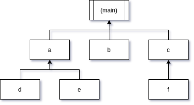

# Loading other taskfiles

You can load other taskfiles using `load`, which takes a taskfile *module path* and loads it. They are loaded such as to the main taskfile, there is no distinction between them, and it can access the subtasks just as well as its own.

## Placement

Trying to use a task `project.taskfile` will look for a module `alfons.tasks.project.taskfile`. We implemented our own path search function that uses `package.path`, so it should load them identically to how `require` does. We needed to implement this function since taskfiles are loaded using the content string, and require would pre-load it.

As such, you can place your tasks in a local directory `alfons/tasks/`, or anywhere on your Lua path. You can also create LuaRocks rockspecs that supply their own taskfiles in that module path.

## Loading

You should always (eheheh) load your taskfiles in the `always` task.

```lua
function always()
  load "fetch"
end

function default()
  print(tasks.fetch("https://example.com"))
end
```

```moon
tasks:
  always:  => load "fetch"
  default: => print tasks.fetch "https://example.com"
```

## Scope

Your tasks will automatically be available from all other taskfiles that have been loaded and the main one.



Rather than writing a linear stream of code here to display what I mean, I decided to just use a graph. These are all loaded taskfiles.

The main taskfile is able to access all of its children's tasks. `a` is not only able to access the main tasks and tasks from `d` and `e`, but also from *every other* taskfile that has been loaded.

This does not hold true for the `always` task, where it will depend on loading order, but since the rest of the tasks are called only once all taskfiles have been loaded, tasks that are not `always` can access any other task.